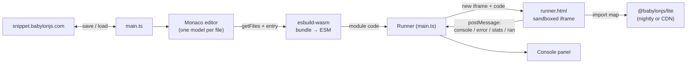

# Babylon Lite Playground

A modern, ES-first playground for [Babylon Lite](../packages/babylon-lite) — edit
TypeScript with full IntelliSense, run it live on a WebGPU canvas, and save & share
snippets. No UMD, no bundler step at author time: snippets are transpiled and run
straight in the browser.

> **Beta.** The Lite Playground is in beta — expect rough edges and breaking
> changes while the experience stabilizes.

## Requirements

- A **WebGPU-capable browser** (Chrome/Edge 113+). Babylon Lite is WebGPU-only.
- **Node 22+** and **pnpm 9+** (managed via corepack) to build/run locally.

## Getting started

It is a workspace package in this monorepo. Run it from the repo root:

```bash
pnpm dev:playground     # http://localhost:5175
pnpm build:playground   # production build into playground/dist
```

(or `pnpm dev` / `pnpm build` from inside `playground/`.)

The first run builds the self-hosted engine bundle and its type definitions, so it
takes a few extra seconds; subsequent runs are incremental.

## Architecture

The app shell (editor + toolbar) runs on the main page. User code is transpiled
in-browser and executed inside a sandboxed iframe that owns the WebGPU canvas, so
each run starts from a clean slate and can't break the surrounding UI.



- **Editor** (`src/editor.ts`) — Monaco editing TypeScript across multiple files
  (one model per file under a `file:///<name>` URI, so both `@babylonjs/lite` and
  relative imports between files resolve), with the engine's rolled-up `.d.ts` wired
  in as the ambient `@babylonjs/lite` module for IntelliSense.
- **File tabs** (`src/file-tabs.ts`) — the horizontal tab bar above the editor:
  add (`+`), rename (double-click), delete (`×`), and pick the bundle entry file
  (the dot on each tab).
- **Transpile** (`src/transpile.ts`) — `esbuild-wasm` bundles the project's files
  in-browser, starting from the entry file and resolving relative imports from an
  in-memory file map while keeping `@babylonjs/lite` external. Any _other_ bare
  package import is rewritten to an active-CDN URL (`https://esm.sh/<pkg>`, or its
  jsDelivr fallback) so external npm packages work without configuration. An inline
  source map keeps runtime stacks mapped to the original files.
- **Runner** (`src/runner.ts` + `public/runner.html`) — a sandboxed iframe hosts the
  WebGPU canvas and an import map resolving `@babylonjs/lite` to the chosen engine
  bundle. Each run recreates the iframe (clean teardown); it relays `console` /
  `error` / `stats` (FPS) / `ran` back over `postMessage`.
- **Engine** (`vite.engine.config.ts` → `src/engine-entry.ts`) — builds the workspace
  engine source into a self-contained ESM under `public/engine/dev/` ("nightly"). The
  version selector can instead load any published release on demand from the active
  ESM CDN (esm.sh, or its jsDelivr fallback) — no redeploy needed.
- **Resizable layout** (`src/split.ts`) — a draggable divider between the editor and
  preview panes; the chosen ratio is persisted in `localStorage` and arrow keys nudge
  it for keyboard users.
- **Download** (`src/download.ts`) — exports the current project as a runnable zip
  (`index.html` + bundled `main.js` + any same-origin assets it references), with the
  engine resolved from the active CDN (esm.sh, or its jsDelivr fallback) via an
  import map.
- **Glue** (`src/main.ts`) — wires the icon toolbar (examples, version selector,
  save, download, run), the run loop, snippet save/load + deep links, and embed mode.

### Project layout

```
playground/
├─ index.html                # App shell + icon toolbar + save dialog
├─ vite.config.ts            # App dev server (port 5175) + /snippet-api dev proxy
├─ vite.engine.config.ts     # Builds the self-hosted "nightly" engine bundle
├─ examples/                 # Larger example sources, imported via ?raw
│  ├─ torus-states.ts        #   (see "Adding examples" below)
│  ├─ neon-ribbons.ts
│  ├─ mosquito-amber.ts
│  └─ havok-physics.ts       #   (Havok wrecking-ball physics demo)
├─ scripts/
│  └─ build-engine-types.ts  # Rolls up the engine .d.ts for Monaco IntelliSense
├─ public/
│  ├─ runner.html            # Sandboxed runner iframe (import map + message bridge)
│  └─ engine/dev/            # Generated nightly engine bundle (git-ignored)
└─ src/
   ├─ main.ts                # App glue: toolbar, run loop, snippets, embed, versions
   ├─ editor.ts              # Monaco multi-model setup + engine-typed IntelliSense
   ├─ file-tabs.ts           # Horizontal file-tab bar (add/rename/delete/entry)
   ├─ split.ts               # Draggable editor/preview divider (persisted ratio)
   ├─ transpile.ts           # esbuild-wasm multi-file bundle → ESM (CDN externals)
   ├─ download.ts            # Export the project as a runnable zip
   ├─ runner.ts              # Owns/recreates the runner iframe
   ├─ examples.ts            # Example registry (inline snippets + ?raw imports)
   ├─ snippets.ts            # Save/load against the Babylon snippet server
   ├─ embed.ts               # ?embed modes + postMessage host bridge + deep links
   ├─ versions.ts            # Engine version list + CDN URL resolution
   ├─ cdn.ts                 # CDN selection with esm.sh → jsDelivr fallback probe
   └─ engine-entry.ts        # Re-exports the engine for the nightly bundle build
```

## Scripts

| Command (in `playground/`) | What it does                                                   |
| -------------------------- | -------------------------------------------------------------- |
| `pnpm dev`                 | `build:engine` + `build:types`, then start the dev server      |
| `pnpm dev:watch`           | Like `dev`, but rebuilds the engine on core source changes     |
| `pnpm build`               | `build:engine` + `build:types`, then build the app             |
| `pnpm build:engine`        | Build the self-hosted nightly engine into `public/engine/dev/` |
| `pnpm build:engine:watch`  | Same, but rebuild on every `packages/babylon-lite/src` change  |
| `pnpm build:types`         | Roll up the engine `.d.ts` for Monaco IntelliSense             |

`build:engine` and `build:types` run automatically before `dev`/`build` (via
`predev`/`prebuild`).

### Developing the engine and playground together

`pnpm dev` builds the self-hosted "nightly" engine bundle **once** at startup, so
edits under `packages/babylon-lite/src` are not reflected until you restart. For a
live loop, use:

```bash
pnpm dev:playground:watch   # from the repo root
# or, inside playground/:
pnpm dev:watch
```

This runs the engine build in `--watch` mode alongside the dev server: change a core
source file, wait for the rebuild (a few seconds), and reload the page to pick it up.
Monaco's IntelliSense type declarations are generated once up front (the api-extractor
pass is too slow to run per keystroke); re-run `pnpm build:types` if you change the
engine's public API and want refreshed editor hints.

### Engine versions

The toolbar's version selector chooses which engine the runner loads:

- **Nightly (latest source)** — the self-hosted bundle built from this workspace.
  Its reported `VERSION` is stamped as `<latest>-nightly` (e.g. `1.4.0-nightly`),
  resolved from the newest `npm-lite-v*` git tag (overridable with `PACKAGE_VERSION`).
- **A published version** — fetched from the active ESM CDN (`https://esm.sh/@babylonjs/lite@<version>`,
  or its jsDelivr fallback) and applied via the runner's import map. The list is
  read from the npm registry.

`public/engine/dev/` and `dist/` are generated and git-ignored.

### CDN fallback (esm.sh → jsDelivr)

External packages and pinned engine releases load from a public ESM CDN. The
primary CDN is **esm.sh**, but it is unreachable in some regions (e.g. Russia).
On first use the playground runs a one-time reachability probe against esm.sh; if
it fails (or times out), the whole session falls back to **jsDelivr**
(`https://cdn.jsdelivr.net/npm/<pkg>/+esm`). The chosen CDN is then used
consistently for the engine import map, esbuild's bare-import rewrite, and
downloads, so a project's entire dependency graph stays on one reachable CDN.
The selection lives in `src/cdn.ts`.

> Browsers can't natively retry a failed static `import` against a second URL, so
> this is a host-level fallback (one probe up front), not a per-package retry. The
> realistic failure mode — esm.sh blocked for the whole region — is exactly what a
> single probe captures.

## Multiple files

Projects can span several files, like the classic playground's multi-file snippets.
The file-tab bar above the editor manages them:

- **Add** — the `+` button creates a new `.ts` file.
- **Rename** — double-click a tab's name, edit, then press Enter.
- **Delete** — the `×` on a tab (disabled when only one file remains).
- **Entry** — the dot on each tab marks the bundle entry point; click another
  tab's dot to make it the entry. The runner bundles starting from the entry file.

Files import each other with relative specifiers, e.g. from `index.ts`:

```ts
import { buildScene } from "./scene";
```

At run time `esbuild-wasm` bundles the entry file and everything it imports into a
single ES module, resolving relative imports from the in-memory file set while
keeping `@babylonjs/lite` external (resolved by the runner's import map). The
**Multi-file** example seeds a two-file project (`index.ts` + `scene.ts`).

All files are persisted in the snippet manifest's `files` map, so saving and
loading round-trips the whole project.

### Importing npm packages

Any bare import other than `@babylonjs/lite` is rewritten to the active ESM CDN
(esm.sh, or its jsDelivr fallback) at bundle time, so external ESM packages work
with no configuration:

```ts
import seedrandom from "seedrandom"; // → the active CDN's seedrandom URL at run time
```

`@babylonjs/lite` is special-cased: it stays on the selected engine (self-hosted
nightly or the pinned CDN release). Absolute `https://` imports are left as-is.

The built-in **Physics — Havok wrecking ball** example shows this end to end: it
imports `@babylonjs/havok` (rewritten to the active CDN) and loads the Havok
WebAssembly binary via `locateFile`, with no local copy of the package or `.wasm`.
Its wasm URL comes from a `?url` import, so it follows the same CDN fallback:

```ts
import HavokPhysics from "@babylonjs/havok";
import havokWasmUrl from "@babylonjs/havok/lib/esm/HavokPhysics.wasm?url";
// → https://esm.sh/...HavokPhysics.wasm (or the jsDelivr equivalent)
const havok = await HavokPhysics({ locateFile: () => havokWasmUrl });
```

A `?url` suffix on a bare specifier resolves to that package asset's **raw-file**
URL on the active CDN (as a string), rather than importing it as a module — the
right shape for a non-module asset like a `.wasm` binary handed to `locateFile`.
It is baked into downloads too, so an exported Havok project stays self-contained.

## Adding examples

Examples populate the toolbar's **Examples** picker. They're registered in
`src/examples.ts`, which exports an `Example` array:

```ts
export interface Example {
    id: string; // stable, unique id (also used by the picker)
    label: string; // shown in the dropdown
    code: string; // entry-file source
    files?: Record<string, string>; // optional: multi-file project
    entry?: string; // optional: entry filename (defaults to index.ts)
}
```

There are two ways to add one:

**1. Small snippet — inline string.** Define a `const` and add an entry:

```ts
const MY_DEMO = `import { createEngine, startEngine } from "@babylonjs/lite";
// …
`;

export const EXAMPLES: Example[] = [
    // …
    { id: "my-demo", label: "My demo", code: MY_DEMO },
];
```

**2. Larger demo (or anything with inline WGSL) — a real file imported with `?raw`.**
Put the source under `playground/examples/<name>.ts` and import it verbatim:

```ts
import MY_DEMO from "../examples/my-demo.ts?raw";
// …
{ id: "my-demo", label: "My demo", code: MY_DEMO },
```

Use this path whenever the code contains backticks (e.g. WGSL `` /* wgsl */ `…` ``
template literals), since those can't be nested inside an inline backtick string.
Files in `examples/` are plain source imported as text — they live outside the
`tsconfig` `include`, so they aren't type-checked against the engine (which isn't
installed as a node module here).

**Multi-file** examples set `files` + `entry` (see the **Multi-file** example):

```ts
{ id: "x", label: "…", code: ENTRY, files: { "index.ts": ENTRY, "scene.ts": SCENE }, entry: "index.ts" },
```

### Rules an example must follow to run

Examples execute inside the sandboxed runner iframe, so they must:

1. **Get the canvas** via `document.getElementById("renderCanvas")`.
2. **Import only from the bare `@babylonjs/lite` specifier.** Subpath imports
   (e.g. `@babylonjs/lite/loader-gltf/draco-decode.js`) won't resolve — the runner
   import map maps only `@babylonjs/lite`.
3. **Reference assets by absolute CDN URL** (e.g. `https://assets.babylonjs.com/…`)
   or from `public/` (e.g. `"/brdf-lut.png"`). Root-absolute (`/…`) assets are
   served by the playground and are bundled into the zip by **Download**; absolute
   `https://` assets stay remote.
4. **Be self-contained** — no page-specific DOM (loading overlays, toggles,
   `canvas.dataset.*`); end with `main().catch((err) => console.error(err))`.

The first three are conventions (not lint-enforced); the `Example` shape itself is
type-checked. After adding an example, run it from the picker to confirm it boots
(the engine logs `Babylon Lite v… - WebGPU engine`) and renders.

## Toolbar

The toolbar uses icon buttons (hover for a tooltip / read the `aria-label`):

- **New** (document) — start a clean starter project. Prompts before discarding
  unsaved edits.
- **Examples** / **Engine version** — the two dropdowns.
- **Save** (floppy) + caret — save & copy link; the caret opens **Save with details…**.
- **Download** (down-arrow) — export the project as a runnable zip (see below).
- **Run** (play) — run the current code (also Ctrl/Cmd+Enter).

The preview pane also has two floating controls in its top-right corner: a live
**FPS** readout and a **fullscreen** toggle for the canvas.

There's no Format button: format with **Shift+Alt+F** or the editor's right-click
**Format Document**. Drag the divider between the editor and preview to resize them
(the ratio is remembered); arrow keys nudge it when it's focused.

### Errors, autosave & the unsaved-changes guard

- **Inline errors** — when a run fails to compile, esbuild's diagnostics are shown
  as red markers in the editor (with entries in the Problems gutter) and as clickable
  lines in the console; clicking one jumps the cursor to the offending file/line.
- **Autosave** — edits are debounced to `localStorage` (`bl-pg-autosave`). If you
  reload or reopen the app without a snippet/`#code=` URL, your last unsaved project is
  restored automatically. Saving a snippet, loading one, or hitting **New** clears it.
- **Unsaved-changes guard** — the browser warns before you close/reload the tab while
  there are unsaved edits (standalone only; disabled in embed mode).

## Snippets

Snippets are saved to and loaded from the Babylon snippet server
(`snippet.babylonjs.com`), the same store the classic playground uses.

- **Save** (toolbar) — stores the current code and copies a permalink
  (`<origin>/snippet/<id>/v/<rev>`) to the clipboard, updating the address bar to
  that path. **Save with details…** (the caret) also captures a title, description,
  and tags.
- **Revisions** — re-saving a loaded snippet creates a new revision of the same id
  (the URL's `/v/<rev>` increments) rather than a brand-new snippet.
- **Load** — opening a `/snippet/<id>/v/<rev>` URL loads that snippet. Legacy
  `#<id>` / `#<id>#<rev>` hash links still load and are rewritten to the path form.

Snippets use the classic V2 manifest envelope plus a `kind: "babylon-lite"` marker,
so the format stays interoperable with the classic loader while letting the Lite
playground reject snippets authored for the classic engine.

## Download

The **Download** button exports the current project as a self-contained zip:

- `index.html` — a minimal host with the canvas and an import map resolving
  `@babylonjs/lite` to the active CDN (the selected version, or latest for nightly).
- `main.js` — the esbuild bundle (relative imports inlined; other npm packages
  already pointing at that CDN's URLs).
- Any **same-origin assets** the scene references by a root-absolute path
  (e.g. `/brdf-lut.png`) are fetched and bundled, with the reference rewritten to a
  relative path.

Serve the folder (e.g. `npx serve`) and open `index.html` — it runs the scene
exactly as in the playground. An internet connection is still needed for the engine
(esm.sh or its jsDelivr fallback, fixed to whichever was reachable at download time)
and any remote `https://` assets.

## Embedding

The playground can be embedded in another page (the classic Babylon playground,
docs, blogs, …) via an iframe and driven over a namespaced `postMessage` API.

```html
<iframe src="https://lite-playground.example/?embed=runner" style="width: 100%; height: 480px; border: 0"></iframe>
```

Modes (`?embed=`):

- `runner` — canvas + console only (no editor); best for docs and demos.
- `split` (also `?embed`, `?embed=1`) — compact editor + canvas so readers can tweak.

Optionally pass `?embedOrigin=https://host.example` to restrict which origin the
embed accepts messages from and posts events to (defaults to `*`).

### postMessage API

Every message carries `channel: "babylon-lite-playground"`. The host sends:

| `type`     | fields         | effect                                                 |
| ---------- | -------------- | ------------------------------------------------------ |
| `loadCode` | `code`, `run?` | replace the entry file's content; run if `run` true    |
| `run`      | —              | run the current code                                   |
| `dispose`  | —              | tear down the running scene                            |
| `getCode`  | —              | request the entry file's content (replies with `code`) |

The `loadCode`/`getCode` API is single-file and targets the entry file. To move a
full multi-file project between the embed and the standalone app, use the **Open in
Lite Playground** handoff (which carries every file).

The embed emits back to the host:

| `type`    | fields          | when                               |
| --------- | --------------- | ---------------------------------- |
| `ready`   | `mode`          | the embed is wired up and bootable |
| `console` | `level`, `text` | a console line from the snippet    |
| `error`   | `text`          | an uncaught runtime error          |
| `stats`   | `fps`           | ~once a second while running       |
| `ran`     | —               | a run finished importing           |
| `code`    | `code`          | reply to a `getCode` request       |

```js
const frame = document.querySelector("iframe");
const channel = "babylon-lite-playground";
window.addEventListener("message", (e) => {
    if (e.data?.channel !== channel) return;
    if (e.data.type === "ready") {
        frame.contentWindow.postMessage({ channel, type: "loadCode", code, run: true }, "*");
    }
});
```

### Deep links

- `/snippet/<id>/v/<rev>` — load a saved snippet (the canonical permalink form).
- `#<id>` / `#<id>#<rev>` — legacy hash links; still load, then rewrite to the path form.
- `#code=<base64url>` — load an inline project (base64url of the project JSON, or
  plain source for legacy links). The embed's **Open in Lite Playground** button
  uses this (or a `/snippet/<id>/v/<rev>` link when saved) to hand the current
  project off to the full standalone playground in a new tab.

## Deployment

The playground deploys to its own subdomain, **liteplayground.babylonjs.com**, via
`azure-pipelines-playground.yml` (mirrors the demos pipeline): it runs
`pnpm build:playground`, zips `playground/dist`, and POSTs it to the Babylon
deployment server, then purges the CDN. The pipeline checks out full history
(`fetchDepth: 0`) so the engine build can resolve the latest `npm-lite-v*` tag for
nightly version stamping. Re-running on each master push keeps nightly current;
chaining it after the npm-publish pipeline keeps it tracking the latest release.

The deploy targets the tools storage account (`TOOLS_STORAGE_ACCOUNT`, from the
`BabylonJS-CI-Infrastructure` variable group) under the `litePlayground` path. The
upload needs only the storage account + path; the CDN endpoint (`lite-playground`)
and profile (`CDN_PROFILE_TOOLS`) are used solely for the post-deploy purge.

Because the site is served from the domain root (a subdomain, not a subpath), all
runtime URLs resolve cleanly and no `base` rewriting is needed.

Snippet permalinks use real paths (`/snippet/<id>/v/<rev>`), so the host must serve
`index.html` for unknown non-file routes (SPA history fallback). The Vite dev server
and `vite preview` do this automatically; a static CDN needs an equivalent rewrite
rule (any path without a file extension → `/index.html`). The dev snippet-server
proxy is mounted at `/snippet-api` (not `/snippet`) specifically so it doesn't
shadow the `/snippet/*` app routes.

**Snippet saving in production:** saves POST directly to `snippet.babylonjs.com`,
whose CORS preflight is origin-allow-listed. `liteplayground.babylonjs.com` must be
added to that allow-list for saving to work in production (loading/sharing via GET
already works cross-origin). In local dev a same-origin Vite proxy (`/snippet-api`)
bypasses the preflight.

## Troubleshooting

- **Blank page on `pnpm dev`** — the dev server binds both IPv4 and IPv6 loopback
  (`host: true`) on a fixed port (`strictPort: true`, 5175). If 5175 is taken the
  server fails loudly instead of drifting; free the port or stop the other process.
- **"WebGPU not supported"** — use a WebGPU-capable browser (Chrome/Edge 113+). In
  some environments WebGPU needs to be enabled explicitly.
- **Saving fails locally** — dev routes saves through the Vite `/snippet-api` proxy
  to bypass the snippet server's origin-allow-listed preflight. If saves fail, confirm
  the dev server (not a static preview) is serving the app.
- **Stale engine after pulling changes** — rebuild the nightly bundle with
  `pnpm build:engine` (it also runs automatically via `predev`/`prebuild`).
